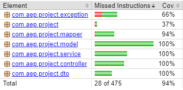

# Faunifica 🦜

PoC para **cadastro e consulta de espécies de animais silvestres**, com o objetivo de organizar informações básicas sobre a fauna e facilitar o acesso a dados relacionados à biodiversidade.

## 🌱 Problema

Informações sobre espécies de animais silvestres podem estar dispersas e pouco organizadas, dificultando sua consulta e o acesso a dados básicos sobre a fauna. O Faunifica propõe uma forma simples de centralizar essas informações em uma aplicação.

## 🌎 ODS 15 — Vida Terrestre

O projeto está alinhado à **ODS 15 — Vida Terrestre**, que busca proteger, recuperar e promover o uso sustentável dos ecossistemas terrestres, além de combater a perda de biodiversidade.

O Faunifica contribui de forma indireta para esse objetivo ao organizar e facilitar a consulta de informações sobre espécies silvestres, incluindo dados como nome popular, nome científico, grupo, bioma, nível de risco e população estimada.

## 💡 Prova de Conceito

A primeira versão da PoC consiste em uma aplicação web integrada a uma API REST para gerenciamento de espécies, permitindo:

* Cadastrar espécies;
* Listar espécies cadastradas;
* Pesquisar espécies por nome popular;
* Consultar uma espécie por seu ID;
* Atualizar dados de uma espécie;
* Excluir uma espécie.

## 🏗️ Arquitetura

* **Controller:** recebe e responde às requisições HTTP;
* **Service:** concentra as regras e operações da aplicação;
* **Repository:** realiza o acesso ao MongoDB;
* **Model:** representa as entidades e enumerações utilizadas;
* **DTO:** define os dados de entrada e saída da API;
* **Mapper:** realiza a conversão entre DTOs e entidades;
* **Exception:** centraliza o tratamento de exceções da aplicação.

## 🛠️ Tecnologias

* Java 21
* Spring Boot 4.1.0
* Spring Data MongoDB
* MongoDB 8
* HTML, CSS e JavaScript
* Docker
* Maven
* JUnit 5
* Mockito
* MockMvc
* JaCoCo
* Git e GitHub

## 🗄️ Banco de Dados

O projeto utiliza o **MongoDB**, banco de dados NoSQL orientado a documentos.

O MongoDB é executado através do Docker Compose.

A aplicação utiliza o banco:

```text
faunifica
```

e a collection:

```text
especies
```

Cada documento da collection representa uma espécie e possui informações como:

* nome popular;
* nome científico;
* grupo;
* bioma;
* nível de risco;
* população estimada.

## ▶️ Execução

### Pré-requisitos

* Java 21
* Maven
* Docker Desktop com suporte ao WSL 2

### 1. Inicie o MongoDB

Na pasta do projeto:

```bash
docker compose up -d
```

### 2. Execute a aplicação

No IntelliJ ou através do Maven:

```bash
mvn spring-boot:run
```

A aplicação estará disponível, por padrão, em:

```text
http://localhost:8080
```

O frontend pode ser acessado diretamente pelo navegador através desse endereço.

## 🧪 Testes automatizados

O projeto possui testes automatizados utilizando JUnit 5, Mockito e MockMvc.

Para executar os testes:

```bash
mvn test
```

Ao final da execução, o Maven deve indicar que os testes foram executados com sucesso.

## 📊 Cobertura de testes

A cobertura de código é medida utilizando o **JaCoCo**.

Após executar:

```bash
mvn test
```

o relatório será gerado em:

```text
target/site/jacoco/index.html
```

Abra o arquivo `index.html` no navegador para visualizar as estatísticas de cobertura, incluindo linhas, métodos e classes.

A AEP estabelece como requisito uma cobertura mínima de **70%** sobre o código da PoC apresentado em cada entrega.

Evidência da cobertura obtida nesta entrega:



## 🖥️ Como testar a PoC

Após iniciar o MongoDB e executar a aplicação, acesse:

```text
http://localhost:8080
```

### Cadastro

1. Clique em **+ Nova espécie**.
2. Preencha os campos solicitados.
3. Clique em **Cadastrar espécie**.
4. Verifique se a espécie aparece na tabela.

### Pesquisa

1. Digite um nome popular no campo de pesquisa.
2. Verifique se a tabela é atualizada mostrando as espécies correspondentes.
3. Apague o texto para voltar à listagem completa.

### Consulta

1. Clique em **Ver mais** em uma espécie.
2. Verifique os dados apresentados no modal.

### Atualização

1. No modal de detalhes, clique em **Atualizar**.
2. Altere um ou mais campos.
3. Clique em **Salvar**.
4. Verifique se os dados foram atualizados na tabela.

### Exclusão

1. Abra o modal de detalhes de uma espécie.
2. Clique em **Deletar**.
3. Confirme a exclusão.
4. Verifique se a espécie foi removida da tabela.

## 🔗 Principais endpoints

| Método | Endpoint                    | Descrição                 |
| ------ | --------------------------- | ------------------------- |
| POST   | `/especies`                 | Cadastra uma espécie      |
| GET    | `/especies`                 | Lista as espécies         |
| GET    | `/especies?nomePopular=...` | Pesquisa por nome popular |
| GET    | `/especies/{id}`            | Consulta uma espécie      |
| PUT    | `/especies/{id}`            | Atualiza uma espécie      |
| DELETE | `/especies/{id}`            | Exclui uma espécie        |

## 🏷️ Versões da entrega

A versão correspondente à primeira entrega da AEP será identificada no repositório GitHub por uma tag específica, permitindo consultar exatamente o estado do projeto apresentado nesta etapa.
